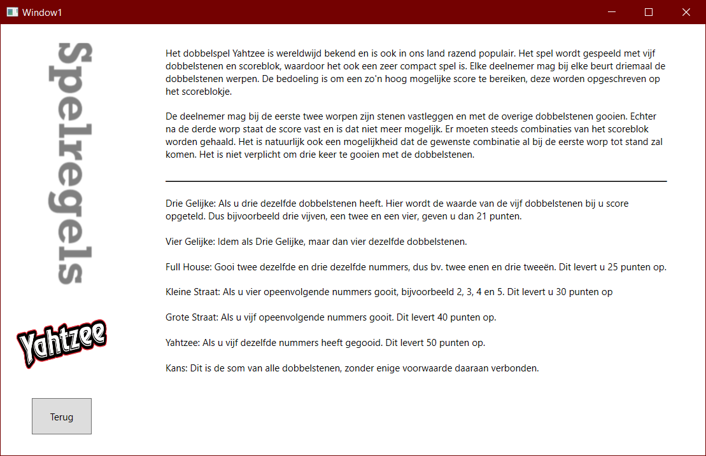
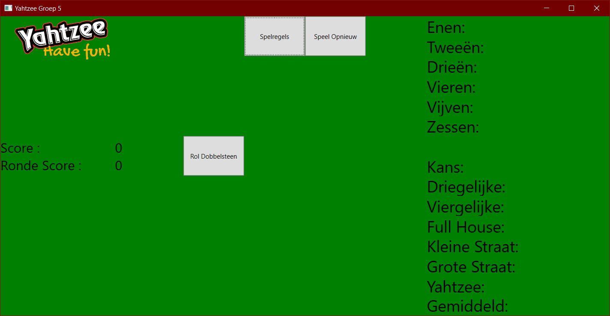

<br />
<p align="center">
  <a href="https://github.com/LucasHuls/Yahtzee-Project-Groep5">
    
  </a>

  <h3 align="center">Scrum Groep 5</h3>

  <p align="center">
    <strong>Menu</strong>
	<br />
	<a href="https://github.com/LucasHuls/Yahtzee-Project-Groep5/wiki"><strong>Wiki »</strong></a>
	<br />
    <a href="https://dev.azure.com/cooleboysz/Yahtzee%20I9AO3"><strong>Scrum-Bord »</strong></a>
	<br />
    <a href="https://github.com/LucasHuls/Yahtzee-Project-Groep5/issues"><strong>Meld een bug »</strong></a>
	<br />
    <a href="https://github.com/lucashuls/Yahtzee-Project-Groep5"><strong>Explore the docs »</strong></a>
	<br />
	<a href="https://github.com/LucasHuls/Calc4You-Project-Groep-5/tree/master/readme-bestanden"><strong>GIT Commands & Uitleg »</a>
  </p>
</p>

## Designs

| Regels 									 | Yahtzee						   |
| :---:        									 |     :---:      							   |
|    |      |

## Yahtzee

Het dobbelspel Yahtzee is wereldwijd bekend en is ook in ons land razend populair. Het spel wordt gespeeld met vijf dobbelstenen en scoreblok, waar het ook een zeer compact spel is. Elke deelnemer mag bij elke beurt driemaal de dobbelstenen werpen. De bedoeling is om een zo’n hoog mogelijke score te bereiken, deze kan vervolgens worden opgeschreven op het scoreblokje. De deelnemer mag bij de eerste twee worpen zijn stenen apart leggen en met de overige dobbelstenen gooien. Echter na de derde worp staat de score vast en is dat niet meer mogelijk. Er moeten steeds combinaties van het scoreblok worden gehaald. Het is natuurlijk ook een mogelijkheid dat de gewenste combinatie al bij de eerste worp tot stand zal komen. Het is niet verplicht om drie keer te gooien met de dobbelstenen.

## Instalatie

1. Clone de repository
```sh
git clone https://github.com/LucasHuls/Yahtzee-Project-Groep5
```

## Team
| Lucas Huls    						  | Bram van Nek 						   | Julian Moreno 		   					 | Sam Elfring 							| Jesse Overveld | Jasper Tempelman |
| ------------- 						  | ------------- 						   | ------------- 		   					 | -------------  						| ------------- | ------------- |
|   |   |  |  |  |  |
| Notulist      						  | Deelnemer  							   | Deelnemer 								 | Scrumleader  						| BordSchrijver | Deelnemer |

## Contact
Voor bugs en problemen kun je beter een issue achter laten klik <a href="https://github.com/LucasHuls/Yahtzee-Project-Groep5">hier</a>
<br>
Jesse Overveld = 0320044@student.rocvantwente.nl
<br>
Bram van Nek = 0320069@student.rocvantwente.nl
<br>
Sam Elfring = 0318893@student.rocvantwente.nl
<br>
Lucas Huls  = 0320242@student.rocvantwente.nl
<br>
Julian Moreno = 0317851@student.rocvantwente.nl
<br>
Jasper Tempelman = 0275910@student.rocvantwente.nl
<br>

## Handige Info
Project Link: https://github.com/LucasHuls/Yahtzee-Project-Groep5
