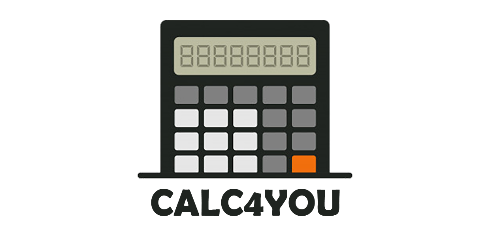
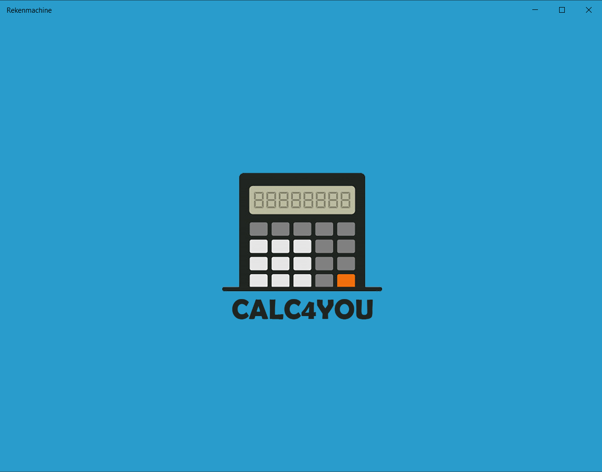
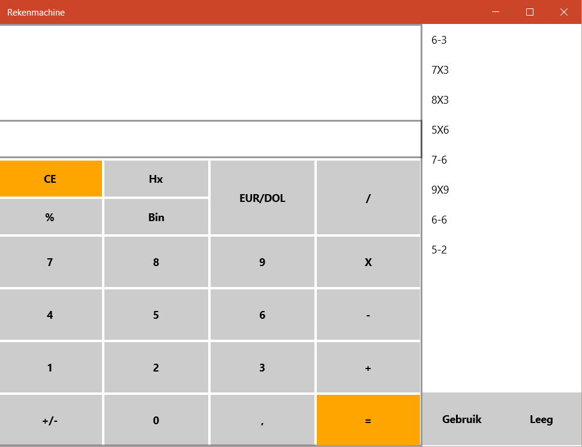

<br />
<p align="center">
  <a href="https://github.com/LucasHuls/Yahtzee-Project-Groep5">
    
  </a>

  <h3 align="center">Scrum Groep 5</h3>

  <p align="center">
    <strong>Menu</strong>
	<br />
	<a href="https://github.com/LucasHuls/Yahtzee-Project-Groep5/wiki"><strong>Wiki »</strong></a>
	<br />
    <a href="https://dev.azure.com/cooleboysz/Yahtzee%20I9AO3"><strong>Scrum-Bord »</strong></a>
	<br />
    <a href="https://github.com/LucasHuls/Yahtzee-Project-Groep5/issues"><strong>Meld een bug »</strong></a>
	<br />
    <a href="https://github.com/lucashuls/Yahtzee-Project-Groep5"><strong>Explore the docs »</strong></a>
	<br />
	<a href="https://github.com/LucasHuls/Calc4You-Project-Groep-5/tree/master/readme-bestanden"><strong>GIT Commands & Uitleg »</a>
  </p>
</p>

## Designs

| Laad-Scherm 									 | Rekenmachine-Design 						   |
| :---:        									 |     :---:      							   |
|    |      |

## Rekenmachine

> Jullie gaan voor het bedrijf Calc4You een applicatie realiseren. Dit bedrijf ontwikkeld oplossingen om mensen te helpen bij rekenen en het inzichtelijk krijgen van hun inkomsten en uitgaven. Hiervoor hebben ze een methode ontwikkeld waarin ze hun klanten laten oefenen met verschillende opdrachten. In deze opdrachten moet er gerekend worden ze willen voor dit doel een rekenmachine applicatie laten ontwikkelen. Maar zij hebben geen Software Ontwikkelaars in dienst, ze hebben daarom aan jullie scrum groep gevraagd om zo'n applicatie voor hun te ontwikkelen. Om duidelijk te krijgen wat er ontwikkeld moet worden gaan jullie in gesprek met jullie coach/product owner om duidelijk te krijgen wat de wensen en eisen zijn. Het is aan jullie om hem uit te nodigen voor een gesprek! 

## Instalatie

1. Clone de repository
```sh
git clone https://github.com/LucasHuls/Yahtzee-Project-Groep5
```

## Team
| Lucas Huls    						  | Bram van Nek 						   | Julian Moreno 		   					 | Sam Elfring 							| Jesse Overveld | Jasper Tempelman |
| ------------- 						  | ------------- 						   | ------------- 		   					 | -------------  						| ------------- | ------------- |
|   |   |  |  |  |  |
| Notulist      						  | Deelnemer  							   | Deelnemer 								 | Bord-Schrijver  						| Scrumleader | Deelnemer |

## Contact
Voor bugs en problemen kun je beter een issue achter laten klik <a href="https://github.com/LucasHuls/Yahtzee-Project-Groep5">hier</a>
<br>
Jesse Overveld = 0320044@student.rocvantwente.nl
<br>
Bram van Nek = 0320069@student.rocvantwente.nl
<br>
Sam Elfring = 0318893@student.rocvantwente.nl
<br>
Lucas Huls  = 0320242@student.rocvantwente.nl
<br>
Julian Moreno = 0317851@student.rocvantwente.nl
<br>

## Handige Info
Project Link: [https://github.com/LucasHuls/Yahtzee-Project-Groep5
